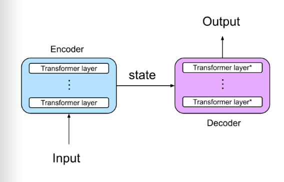
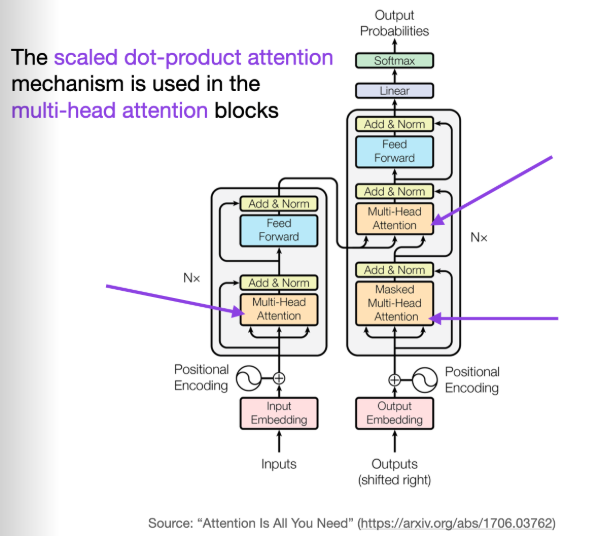

# Notes on: Understanding Large Language Models
- What is an LLM? Neural n/w desgned to understand, generate, and respond to human-like text.
- It is often refered to generative artificial intelligence ot GenAI.
- The first training state of an LLM is known as 'pretraining' often called as a base or foundational model.
- This pretrained model is capable of text completion, and limited in-context learning capabilities.
- When we train this pretained model on any downstream task, the new model is called 'fine-tuned' model and the process is called fine-tuning.
- The two most popular fine-tuning are 'instruction fine-tuning' and other is 'classification fine-tuning'.
- Almost all the LLMs rely on 'transformer' architecture.

- Transformer architecture are made from two sub-module: 'encoder' and 'decoder'
- The encoder module process the inputs and make it series of numerical representation that try to capture contextual representation.
- Then the decoder module take these representational vactors and produce the output.
- Both the encoder and decoder consist of many layers connected by a mechanism called self-attention.

- These encoder and decoder architecture acn be saperated to perform other task such as BERT is an encoder based architecture and GPT is a decoder based architecture.
- since deocder type model like GPT generate text by pretrdicting text one word at a time, they are considered a type of 'autoregressive model'.
- The ability to perform tasks that the model wasn't explicitly trained to perform is called an 'emergent behaviour'. 